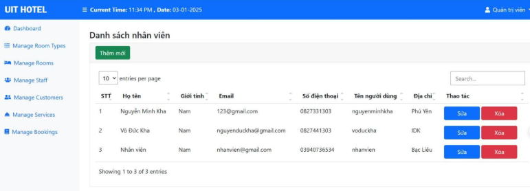
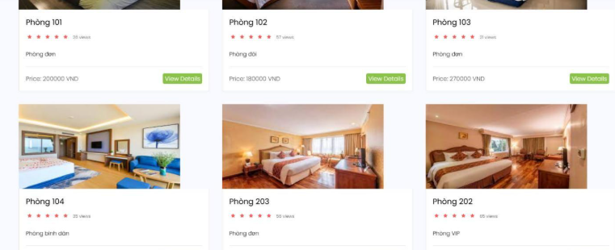
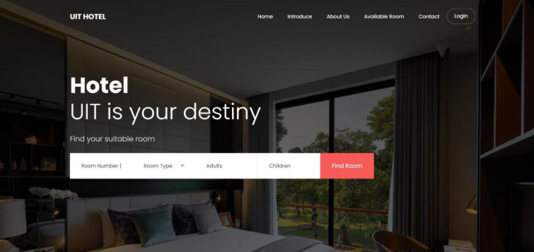
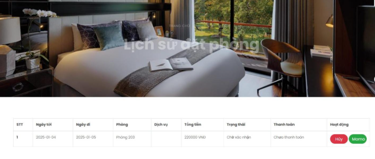

# Hotel Management System

## Introduction

Hotel Management System is a web application built with ASP.NET MVC to streamline hotel operations. This system allows efficient management of room bookings, customer records, room details, and various hotel services. It was developed as part of the SE100 OOAD course at UIT.

## Project Roles and Features

### 🏨 Customer Role
- **View Room Information:** Browse available rooms and view detailed information.
- **Book Rooms:** Reserve rooms online with a user-friendly interface.
- **Manage Bookings:** Update or cancel reservations as needed.
- **Secure Payments:** Process online payments safely through integrated payment gateways.

### 🔧 Admin Role
- **Manage Rooms:** Add, update, or delete room information.
- **Manage Bookings:** Review and approve customer bookings.
- **Manage Services:** Oversee additional hotel services such as dining, laundry, etc.
- **Reporting:** Generate reports on revenue, occupancy rates, and other key metrics.

## Demo Screenshots

### 🔧 Admin Dashboard


### 🏨 Available Room


### 🏠 Home Page


### 📝 Order History


## Setup & Installation

### Prerequisites
- Visual Studio (preferably VS 2022)
- .NET Framework (version 4.5 or later)
- SQL Server

### Installation Steps

1. **Clone the Repository:**
   ```bash
   git clone <repository_url>
   cd Hotel(ooad)
   ```

2. **Configure the Database:**
   - Update the connection string in the `web.config` file:
     ```xml
     <connectionStrings>
       <add name="HotelDB" connectionString="Data Source=YOUR_SERVER;Initial Catalog=HotelDB;Integrated Security=True" providerName="System.Data.SqlClient" />
     </connectionStrings>
     ```
   - If necessary, run the migration command to update the database:
     ```bash
     Update-Database
     ```

3. **Open and Run the Project:**
   - Open the solution in Visual Studio.
   - Restore NuGet packages if prompted.
   - Press `F5` or click the “Start” button to run the application.

## Contributions

Contributions are welcome! If you have suggestions, bug reports, or new feature ideas, please fork the repository, create a new branch, and submit a pull request. You can also open an issue on GitHub to report any problems.

## License

This project is licensed under the MIT License.

